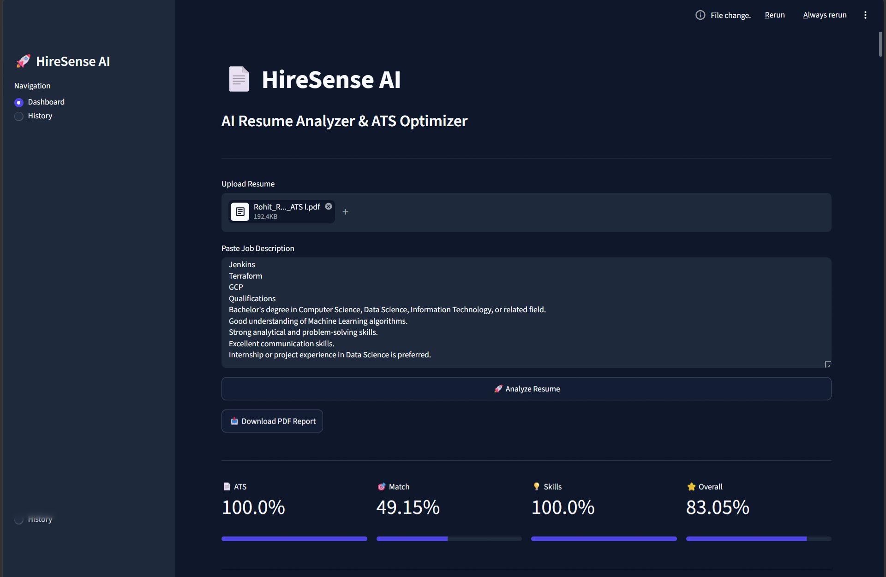
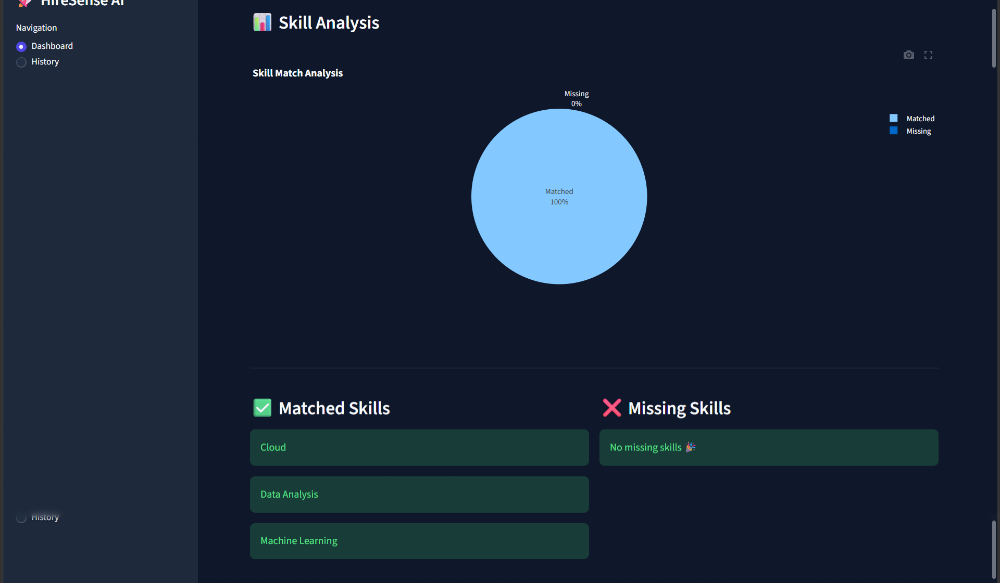
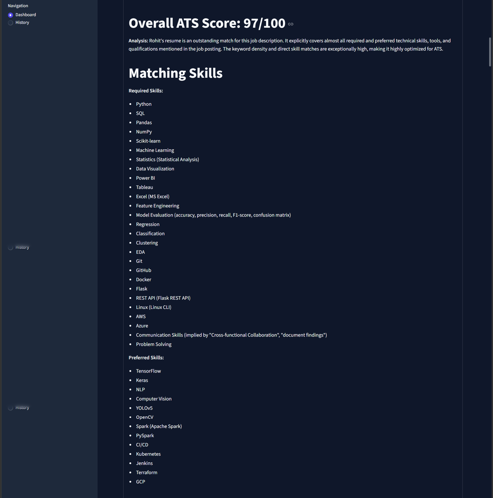

# 🚀 HireSense AI

<div align="center">

# 📄 HireSense AI
### AI Resume Analyzer & ATS Optimization Platform

An AI-powered Resume Analyzer that evaluates resumes against job descriptions, calculates ATS scores, identifies skill gaps, and generates intelligent feedback using **Google Gemini AI**.

Built with **Python**, **Streamlit**, **Google Gemini**, **SQLite**, and **Machine Learning**.

---


</div>

---

# 📸 Screenshots

## 🏠 Dashboard



---

## 📊 Skill Analysis



---

## 🤖 AI Resume Feedback



---

# ✨ Features

✅ Resume Parsing (PDF)

✅ ATS Score Calculation

✅ Resume vs Job Description Matching

✅ Skill Gap Analysis

✅ Keyword Matching

✅ AI Resume Feedback using Google Gemini

✅ Interactive Skill Visualization

✅ Download PDF Report

✅ Resume History (SQLite)

✅ AI Resume Rewriter

✅ AI Interview Question Generator

✅ AI Cover Letter Generator

---

# 🛠 Tech Stack

| Category | Technologies |
|------------|-------------|
| Frontend | Streamlit |
| Backend | Python |
| AI | Google Gemini API |
| Database | SQLite |
| NLP | spaCy |
| Machine Learning | Scikit-learn |
| Visualization | Plotly |
| PDF Parsing | PDFPlumber, PyMuPDF |
| Report Generation | ReportLab |
| Data Processing | Pandas, NumPy |

---

# 📂 Project Structure

```text
HireSense-AI
│
├── app.py
├── README.md
├── LICENSE
├── requirements.txt
├── .env
├── .gitignore
│
├── assets/
│   ├── dashboard.png
│   ├── skill_analysis.png
│   └── ai_feedback.png
│
├── data/
│   ├── resumes/
│   ├── job_descriptions/
│   └── skills/
│
├── database/
│   ├── database/
│   └── db.py
│
├── outputs/
│
├── reports/
│
├── scripts/
│
├── src/
│   ├── ai_feedback.py
│   ├── ats.py
│   ├── cover_letter.py
│   ├── embeddings.py
│   ├── interview_generator.py
│   ├── jd_parser.py
│   ├── parser.py
│   ├── preprocessing.py
│   ├── report_generator.py
│   ├── resume_rewriter.py
│   ├── similarity.py
│   ├── skills.py
│   ├── utils.py
│   └── visualizer.py
│
├── ui/

```

---

# ⚙ Installation

Clone the repository

```bash
git clone https://github.com/Rohittt619/HireSense-AI.git
```

Go inside project

```bash
cd HireSense-AI
```

Create Virtual Environment

```bash
python -m venv venv
```

Activate Virtual Environment

### Windows

```bash
venv\Scripts\activate
```

Install dependencies

```bash
pip install -r requirements.txt
```

---

# 🔑 Environment Variables

Create a `.env` file in the root directory.

```env
GEMINI_API_KEY=YOUR_GEMINI_API_KEY
```

---

# ▶ Run Application

```bash
streamlit run app.py
```

Open

```
http://localhost:8501
```

---

# 🧠 How It Works

```text
Upload Resume
        │
        ▼
Upload Job Description
        │
        ▼
Resume Parsing
        │
        ▼
Skill Extraction
        │
        ▼
ATS Score Calculation
        │
        ▼
Gemini AI Analysis
        │
        ▼
PDF Report Generation
```

---

# 📈 Modules

### 📄 Resume Parser

- Reads PDF Resume
- Extracts text
- Cleans formatting

---

### 🎯 ATS Score

Calculates

- Keyword Match
- Resume Quality
- Skill Match
- Overall ATS Score

---

### 🤖 AI Feedback

Google Gemini provides

- Resume Strengths
- Resume Weaknesses
- Improvement Suggestions
- Final Verdict

---

### 📊 Skill Analysis

Visualizes

- Matched Skills
- Missing Skills
- Skill Percentage

---

### 📥 PDF Report

Generates downloadable professional report including

- ATS Score
- Skill Match
- AI Feedback
- Suggestions

---

### ✍ AI Resume Rewriter

Generates

- Improved Resume Summary
- ATS Friendly Bullet Points
- Better Professional Content

---

### 🎤 AI Interview Questions

Creates interview questions based on

- Resume
- Job Description
- Skill Gap

---

### 📄 AI Cover Letter

Automatically generates personalized cover letter matching the uploaded resume and job description.

---

# 🚀 Future Improvements

- Resume Ranking System
- Multiple Resume Comparison
- LinkedIn Profile Analyzer
- AI Mock Interview
- Resume Templates
- Job Recommendation Engine
- Recruiter Dashboard
- Resume Chatbot
- Multi-language Resume Analysis

---

# 🤝 Contributing

Contributions are welcome!

1. Fork the repository

2. Create a new branch

```bash
git checkout -b feature-name
```

3. Commit changes

```bash
git commit -m "Added new feature"
```

4. Push changes

```bash
git push origin feature-name
```

5. Create Pull Request

---

# 👨‍💻 Author

## Rohit Rathod

🎓 B.Tech (Data Science)

💼 Aspiring Data Analyst | AI & Machine Learning Enthusiast

### GitHub

https://github.com/Rohittt619

### LinkedIn

https://www.linkedin.com/in/rohit-rathod-19442a228/

---

# 📜 License

This project is licensed under the MIT License.

See the LICENSE file for details.

---

<div align="center">

⭐ If you found this project useful, don't forget to star the repository!

Made with ❤️ by Rohit Rathod


